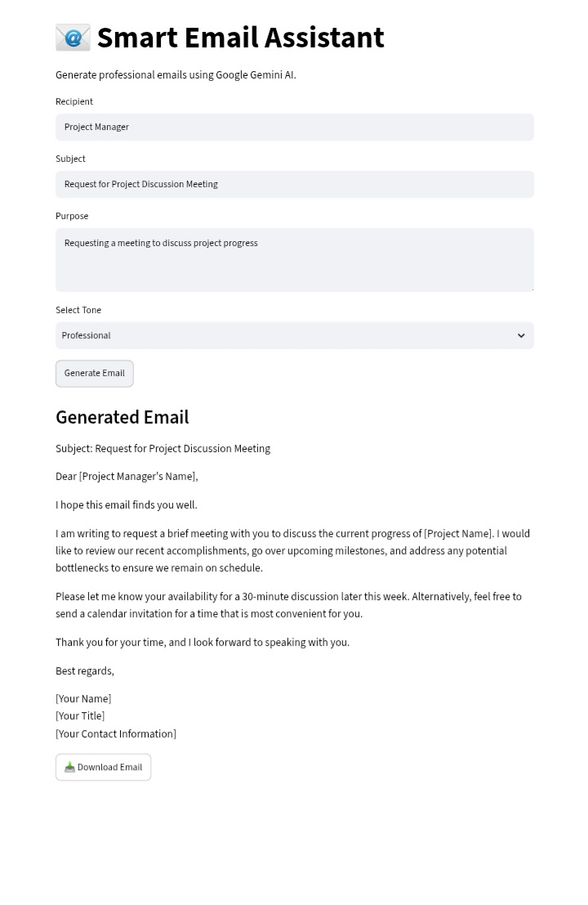

# 📧 Smart Email Assistant

## Overview

Smart Email Assistant is an AI-powered application that helps users generate professional emails using Google Gemini AI.

The application takes user inputs like recipient, subject, purpose, and tone, then generates a well-structured professional email automatically.

## 🚀 Features

- Generate professional emails using Google Gemini AI
- Select different email tones:
  - Professional
  - Friendly
  - Formal
- Download generated emails as a text file
- Simple and user-friendly Streamlit interface
- Secure API key handling using Streamlit Secrets

## 🛠️ Technologies Used

- Python
- Streamlit
- Google Gemini AI API
- Google GenAI SDK

## 📂 Project Structure
Smart-Email-Assistant/ │ ├── app.py                 # Main Streamlit application ├── export_utils.py        # Email export utility ├── requirements.txt       # Required Python libraries ├── README.md              # Project documentation │ └── .streamlit/ └── secrets.toml       # API key configuration
## ⚙️ Installation & Setup

# 1. Clone Repository

```bash
git clone <your-github-repository-link>
# 2.Install Dependencies

pip install -r requirements.txt

# 3. Configure Gemini API Key

Create a .streamlit/secrets.toml file:
GEMINI_API_KEY="your_api_key_here"
▶️ Run Application
Start the Streamlit app:
streamlit run app.py
The application will open in your browser.

📌 How It Works
Enter recipient name
Enter email subject
Describe the purpose of the email
Select required tone
Click "Generate Email"
AI generates a professional email
Download the generated email

🎯 Use Cases
Professional communication
Job application emails
Leave request emails
Business emails

Formal messages
🔮 Future Enhancements
Add multiple AI agents
Resume analysis agent
Code debugging agent
Voice-based email generation
Email templates library

License
This project is developed for educational purposes.

## 📸 Application Screenshot


